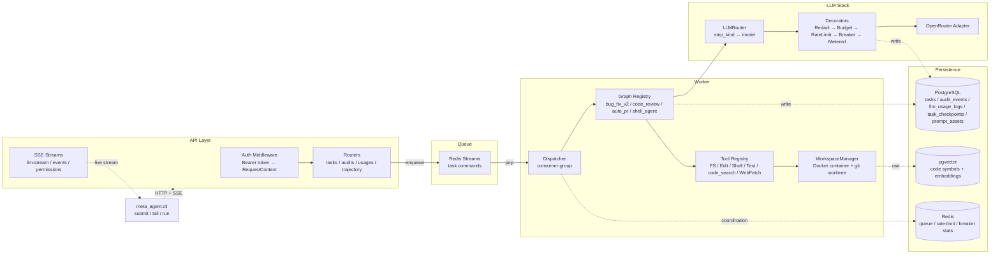

# meta-agent

> **Bug Fix CLI Agent** — production-grade LLM workflow: plan → tool-use loop →
> code edit → verify → PR. Built with multi-tenant audit / cost / reliability
> patterns so the same shape ports cleanly to other automation domains (Test
> Generation, CI failure triage, internal workflow agents).

## TL;DR

| | |
|---|---|
| **What it does** | Takes a bug description + repo, drives a plan-act-observe agent loop that reads code, edits files, runs a verifier (lint / type-check / tests), produces a PR-ready patch. |
| **How** | LangGraph-style state machine (custom, no LangChain dep) over a Tool Calling registry; pgvector-backed code search; OpenRouter for LLM (BYO key) with per-step model routing |
| **Why production-shape** | Multi-tenant audit + cost tracking + budget gate + circuit breaker + rate limiter + redaction layer + checkpoint resume — patterns required for enterprise deployment, present from day 1 |
| **Architecture transferability** | The same graph + tool registry shape supports Test Generation Agent / CI Triage Agent / Workflow Automation Agents — swap the Tool set, keep the engine (see Roadmap) |

**Goal**: demonstrate ability to ship LLM-driven workflow systems with the
production patterns enterprise deployment actually needs — auditing,
observability, reliability, cost control, human-in-the-loop. Not a generic
chatbot; not a research benchmark. A focused automation agent.

## Quick start (5 commands to first task)

```bash
# 1. Configure
cp .env.example .env
# edit .env:
#   OPENROUTER_API_KEY=sk-or-v1-...
#   META_AGENT_API_KEYS=dev-token:default-tenant:default-user

# 2. Start stack (postgres + redis + migrations + api + worker)
docker compose up --build -d

# 3. Wait ~20s for migrations, then submit a task
python -m meta_agent.cli submit \
    --task-type bug_fix \
    --api-url http://localhost:8000 \
    --token dev-token \
    --payload '{"user_prompt": "...", "repo_url": "https://github.com/.../.git", "base_ref": "main"}'

# 4. Tail it
python -m meta_agent.cli tail <task_id>

# 5. Inspect audit + cost trail (any time after task starts)
curl -H "Authorization: Bearer dev-token" \
     "http://localhost:8000/v1/tasks/<task_id>/trajectory"
```

## Architecture



## Key engineering decisions

| Decision | Why | Trade-off |
|---|---|---|
| LangGraph-style **custom** state machine, not LangChain/LangGraph | Type-safe Pydantic state; async-first; Port pattern for multi-tenant LLM/Tool/Workspace; no framework dictating audit shape | Maintain our own engine; can't drop in LangChain plugins |
| `step_kind` model routing | Cheap models for planning, capable for editing, dedicated for review — measurable per-step cost | Extra routing config; needs benchmarking per step type |
| Multi-tenant from day 1 (`tenant_id` everywhere) | Production code agents must be safe across users; isolating after the fact is a refactor disaster | Slightly more verbose schemas; one-tenant demo mode for now |
| Container sandbox + git worktree per task | Agent can run untrusted shell commands; tasks isolated from each other | Slower startup (docker pull / exec overhead) |
| Outbox + webhook for async notifications | Long human-in-the-loop pauses without holding worker resources | Extra storage; eventual-consistency between webhook and API |
| **No** LangSmith / proprietary SaaS observability | Audit + usage tables are source of truth; Langfuse can plug in for analysis without vendor lock-in | Have to build basic dashboard views; Langfuse integration deferred |
| BYO LLM key (client-side) | Customer LLM bills go to their provider; we don't hold credentials | Need redaction layer to protect customer secrets in prompts |

## Capabilities (delivered)

### L1 graphs (`src/meta_agent/core/orchestration/graphs/`)

- **`bug_fix_v2`** — plan / patch / verify / push / finalize. shell_agent loop with deterministic verify; multi-language (Python ruff+pytest, TypeScript tsc+vitest). Replans once on verify failure with prior plan + diff + verifier output as feedback.
- **`code_review`** — pure-LLM structured review (Pydantic schema: verdict / findings[] / confidence). No workspace required.
- **`auto_pr`** — publishes a feature-branch commit as PR via `GitProvider` Port (FakeGitProvider + GitHubGitProvider). `BUG_FIX → AUTO_PR` follow-up chain.
- **`shell_agent`** — underlying plan → tool_call → observe loop. Used by bug_fix_v2; available as `system_shell_agent` for ad-hoc tool use.

### Tool registry

`FileSystemTool` (read / list / grep) · `EditTool` (write / patch apply) · `ShellTool` (allow-list + timeout + output cap) · `TestTool` (Python + TypeScript verifier suites) · `code_search` / `get_definition` / `get_references` / `outline` (tree-sitter + pgvector) · `WebFetch` (URL → text, domain allow-list) · `DocSearch`.

### Production patterns (from `α` / `γ` phases)

- **Auth**: `TokenValidator` Port (env CSV + DB-backed); `Authorization: Bearer <token>` → `RequestContext`
- **Rate limit**: Redis token bucket, tenant × model × tool dimensions
- **Circuit breaker**: `pybreaker` + Redis shared stats; explicit fallback
- **Budget**: per-task + per-tenant; `BudgetPolicy` ∈ {none, gate, abort}
- **Audit**: `audit_events` table writes every graph decision (rate limited, redacted, signed by `step_kind`)
- **Cost tracking**: `llm_usage_logs` per LLM call (model / tokens / cost / step_kind / prompt_version)
- **Checkpoint resume**: worker restart picks up RUNNING tasks from `task_checkpoints`
- **Human-in-the-loop**: `PermissionMode` ∈ {auto, approve_before_push, approve_each_tool, plan}
- **Trajectory replay**: `GET /v1/tasks/{id}/trajectory` joins audit + checkpoints + usage
- **Prompt redaction**: LLM request + response scanned for secrets / PII before logging
- **Async notification**: Outbox + webhook with HMAC + retry + dedupe + dead-letter

## Roadmap (architecture transferability)

The same graph + tool registry pattern supports:

- **Test Generation Agent** — swap `EditTool` for `TestGenerationTool`; same plan-act-observe loop. Spike PR planned.
- **CI Failure Triage Agent** — swap tools to `log_query` / `git_blame` / `diagnose`. Same graph engine.
- **PR Review Agent** — `code_review` graph is the seed; expand with `static_analysis_tool` for rule-based checks.

These are domain shifts (different Tool set + different prompts), not engine rewrites — the production scaffolding (auth / audit / cost / breaker / checkpoint / redaction / human-in-the-loop) ports unchanged.

## Project structure

```
src/meta_agent/
├── api/              # FastAPI + routers (tasks / sessions / audits / usages / trajectory / SSE streams)
├── cli/              # submit / tail / run subcommands
├── core/
│   ├── domain/       # Task / TaskResult / Permission / Outbox / Webhook (Pydantic models)
│   ├── ports/        # LLMClient / RateLimiter / CircuitBreaker / WorkspaceManager / GitProvider / etc.
│   └── orchestration/
│       ├── graphs/   # bug_fix_v2 / code_review / auto_pr / shell_agent / echo / git_inspect
│       └── ...       # GraphRegistry / GraphRunner / state machine primitives
├── infra/            # Port implementations
│   ├── llm/          # OpenRouter adapter + decorators (Redact / Budget / RateLimit / Breaker / Metered / Router)
│   ├── persistence/  # Asyncpg pool + repos
│   ├── workspaces/   # DockerWorkspaceManager + LocalWorkspaceManager
│   ├── tools/        # Local + Docker workspace tools
│   ├── ratelimit/    # Redis token bucket + in-memory
│   ├── circuitbreaker/  # pybreaker + Redis shared
│   ├── webhook/      # Outbox dispatcher + HMAC signer
│   └── ...
└── worker/           # Dispatcher / GraphRunner / WorkspaceManager wiring / shutdown
```

## Not in scope (deliberately)

These are spec'd designs but not built. Each is a focused follow-up if a real deployment demand surfaces:

- K8s Helm chart / Prometheus / OTel exporter / SSO / RBAC / Web UI (Phase ε)
- gVisor / Firecracker sandbox (Phase ζ)
- AGENTS.md project memory / PR review feedback / BYO LLM config UI / MCP Server (Phase δ-3)
- VS Code plugin (was built; removed because the focused product is CLI)
- Multi-agent orchestration / hooks / plugins (L2 platform layer, beyond focused agent scope)

## Tech stack

Python 3.11+ · Pydantic v2 · FastAPI · asyncpg · Redis Streams · pgvector · OpenRouter (BYO key) · pybreaker · Docker · alembic.

## Test plan

```bash
pytest -q                    # ~940 unit tests
pytest -m integration        # docker-compose + real db / redis tests
mypy                         # strict
ruff check . && ruff format --check .
```

## References

- `docs/specs/AGENT_SPEC.md` — full product spec
- `docs/specs/INFRA_SELECTION_MATRIX.md` — Redis Streams vs alternatives, etc.
- `docs/specs/CONTEXT_PROPAGATION.md` — trace_id / tenant_id propagation contract
- `CLAUDE.md` — development collaboration rules
